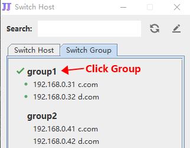

# SwitchHostUtil Doc

#### 下载

最新版1.0.2
https://github.com/ZhouJunjun/SwitchHostUtilDoc/releases


#### 说明

1.   默认hosts读取：

     Window: C:\Windows\System32\drivers\etc\hosts

     Other: /etc/hosts

2.   需要先安装JDK8+，再执行jar文件

3.   分组格式

     ```
     #==== name
     127.0.0.1 a.com
     #====
     ```

4.   示例

     ```
     192.168.0.1 a.com
     192.168.0.2 b.com
     
     #==== group1
     192.168.0.31 c.com
     192.168.0.32 d.com
     #====
     
     #==== group2
     #192.168.0.41 c.com
     #192.168.0.42 d.com
     #====
     ```
     
